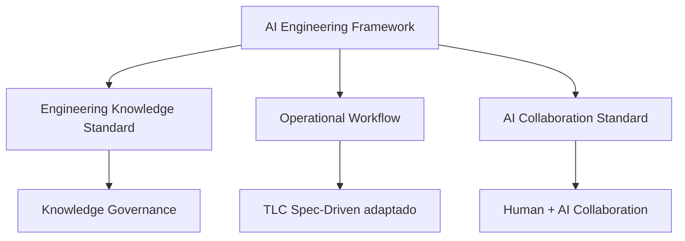

# RFC-001 — AI Engineering Framework (AEF)

**Status:** Proposed  
**Versão:** 1.0  
**Owner:** Engenharia  
**Público-alvo:** Produto, Design, Arquitetura, Engenharia, QA e Agentes de IA

---

## 1. Objetivo

Definir o framework oficial de engenharia para desenvolvimento de software assistido por IA.

O AEF não é apenas um processo de documentação. Ele estabelece como a organização transforma trabalho de desenvolvimento em **conhecimento organizacional durável**.

O framework combina três pilares:

1. **Engineering Knowledge Standard (EKS)** — governança do conhecimento.
2. **Operational Workflow** — workflow operacional baseado em TLC Spec-Driven Development, adaptado para Feature Design.
3. **AI Collaboration Standard** — colaboração entre pessoas e agentes de IA.

---

## 2. Decisão

A organização adota o **AI Engineering Framework (AEF)** como padrão para desenvolvimento assistido por IA.

O workflow operacional é baseado no **TLC Spec-Driven Development**. Internamente, o artefato produzido na fase de Specify será chamado de **Feature Design**, para evitar ambiguidade com PRD, RFC, ADR, TDD ou documentação técnica.

O processo é considerado concluído apenas após a etapa de **Knowledge Consolidation**, quando todo artefato produzido durante a feature é descartado, promovido ou atualizado conforme seu valor organizacional.

---

## 3. Filosofia

> Desenvolvimento de software produz conhecimento. Código é apenas uma das manifestações desse conhecimento.

Toda feature pode gerar:

- implementação;
- testes;
- decisões arquiteturais;
- decisões de produto;
- padrões reutilizáveis;
- conhecimento operacional;
- artefatos temporários.

O objetivo do AEF é preservar somente o conhecimento que continuará útil após a entrega.

---

## 4. Princípios

### 4.1 Código é a fonte da verdade da implementação

O código explica como o sistema funciona. Nenhum documento deve duplicar controllers, services, repositories, sequência de chamadas ou detalhes de implementação.

### 4.2 Testes são a fonte da verdade do comportamento esperado

Testes documentam garantias observáveis. Se uma regra é crítica, deve existir teste.

### 4.3 Artefatos explicam o que o código não explica

Artefatos devem responder: por quê, para quê, sob quais restrições e com quais trade-offs.

### 4.4 Densidade de conhecimento acima de volume

Um artefato é valioso quando entrega conhecimento novo com baixo esforço de leitura.

### 4.5 Todo artefato possui ciclo de vida

Nada deve permanecer por inércia. Todo artefato deve ter destino definido: manter, descartar, promover ou atualizar.

---

## 5. Componentes do Framework



### 5.1 Engineering Knowledge Standard

Define como o conhecimento é classificado, armazenado, promovido e descartado.

Documento normativo: [`STD-001`](../02-standards/STD-001-engineering-knowledge-standard.md)

### 5.2 Operational Workflow

Define como features são executadas com apoio de IA.

Documento normativo: [`RFC-002`](./RFC-002-operational-workflow.md)

### 5.3 AI Collaboration Standard

Define responsabilidades de Produto, Design, Arquitetura, Engenharia, QA e IA.

Documento normativo: [`RFC-004`](./RFC-004-ai-collaboration-standard.md)

---

## 6. Workflow macro

```text
Discovery
  → Feature Design
  → Planning
  → Implementation
  → Validation
  → Knowledge Consolidation
```

A etapa de **Knowledge Consolidation** é uma extensão organizacional ao workflow operacional. Ela é obrigatória antes de considerar uma feature concluída.

---

## 7. Responsabilidades principais

| Área | Responsabilidade |
|---|---|
| Produto | Problema, objetivo, escopo, regras de negócio e PRD. |
| Design | UX, fluxos, handoff e critérios de experiência. |
| Arquitetura | Decisões técnicas, trade-offs, ADRs e coerência sistêmica. |
| Engenharia | Implementação, testes, plano de execução e consolidação. |
| QA | Estratégia de teste, critérios de aceite e validação. |
| IA | Apoio à análise, planejamento, implementação e revisão. |

A governança do conhecimento permanece responsabilidade humana.

---

## 8. Definition of Done do Framework

Uma feature só está concluída quando:

- código foi implementado;
- testes passam;
- critérios de aceite foram validados;
- riscos relevantes foram tratados;
- Knowledge Consolidation foi executada;
- ADR foi criado quando houve decisão permanente;
- Guidelines foram atualizadas quando surgiu padrão reutilizável;
- PRD foi atualizado quando houve mudança de produto;
- artefatos transitórios foram removidos.

---

## 9. Fora do escopo

Este framework não define ferramenta obrigatória. Pode ser usado com GitHub, GitLab, Jira, Linear, Notion, Confluence, Cursor, Copilot, ChatGPT, Claude, Codex ou ferramentas equivalentes.

---

## 10. Documentos relacionados

- [`STD-001 — Engineering Knowledge Standard`](../02-standards/STD-001-engineering-knowledge-standard.md)
- [`RFC-002 — Operational Workflow`](./RFC-002-operational-workflow.md)
- [`STD-002 — Feature Design Standard`](../02-standards/STD-002-feature-design-standard.md)
- [`RFC-003 — Artifact Catalog`](./RFC-003-artifact-catalog.md)
- [`RFC-004 — AI Collaboration Standard`](./RFC-004-ai-collaboration-standard.md)

---

## 11. Regra de ouro

> O repositório armazena conhecimento organizacional durável, não o histórico transitório do desenvolvimento.
