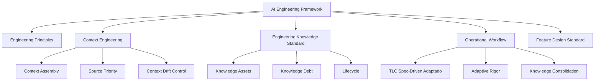

# RFC-001 — AI Engineering Framework (AEF)

**Status:** Proposed  
**Versão:** 2.0  
**Owner:** Engenharia  
**Público-alvo:** Produto, Design, Arquitetura, Engenharia, QA e Agentes de IA

---

## 1. Objetivo

Definir o framework oficial para engenharia de software assistida por IA.

O AEF é um framework **knowledge-centric**. Ele organiza como a empresa:

- desenvolve software;
- colabora com agentes de IA;
- monta contexto técnico;
- evita drift;
- promove conhecimento durável;
- remove artefatos transitórios.

---

## 2. Tese central

> Desenvolvimento de software não deve produzir documentação por padrão. Deve produzir software, decisões e Knowledge Assets.

Um **Knowledge Asset** é qualquer artefato que carrega conhecimento útil para execução, decisão ou evolução do sistema.

Nem todo Knowledge Asset deve permanecer. O processo define quando manter, promover ou deletar.

---

## 3. Pilares do framework



---

## 4. Princípios

Os princípios normativos estão em [`engineering-principles.md`](../engineering-principles.md).

Resumo:

1. Código é a verdade da implementação.
2. Testes são a verdade comportamental.
3. Conhecimento precisa sobreviver à implementação.
4. O repositório deve ser legível por humanos e IA.
5. Todo artefato possui ciclo de vida.
6. Humanos são donos das decisões.
7. O rigor deve ser proporcional ao risco.
8. Drift é dívida.
9. Contexto é um ativo de engenharia.
10. Deletar é um resultado válido.

---

## 5. Workflow operacional

O AEF usa **TLC Spec-Driven Development** como referência operacional.

Internamente, a fase de Specify é representada pelo artefato **Feature Design**.

```text
Discovery
  → Feature Design
  → Planning
  → Implementation
  → Validation
  → Knowledge Consolidation
```

A etapa de Knowledge Consolidation é obrigatória.

---

## 6. Workflow adaptativo

O rigor do processo deve ser proporcional à complexidade e risco.

| Tipo de mudança | Processo mínimo | Feature Design | ADR |
|---|---|---:|---:|
| Bug simples | Código + testes | Não | Não |
| Pequena feature | Feature Design light + testes | Light | Raro |
| Feature média | Processo completo | Sim | Se necessário |
| Feature grande | Processo completo + rollout | Sim | Provável |
| Mudança arquitetural | Processo completo + validação arquitetural | Sim | Obrigatório |
| Novo serviço/plataforma | Processo completo + operação + contratos | Sim | Obrigatório |
| Mudança regulatória | Processo completo + compliance | Sim | Possível |

---

## 7. Papéis no workflow

| Fase | Owner humano | IA pode apoiar com |
|---|---|---|
| Discovery | Produto | síntese, perguntas, análise de lacunas |
| Feature Design | Produto + Engenharia | draft, riscos, critérios, alternativas |
| Planning | Engenharia | decomposição, dependências, sequência |
| Implementation | Engenharia | código, refatoração, testes |
| Validation | Engenharia + QA | revisão, casos de teste, análise estática |
| Knowledge Consolidation | Engenharia + Arquitetura | sugestões de promoção e remoção |

IA é transversal. Não existe uma fase “da IA”.

---

## 8. Artifact Decision Tree

```text
Nova informação
  ├─ muda produto ou regra de negócio? → PRD
  ├─ muda arquitetura ou trade-off permanente? → ADR
  ├─ muda API, evento ou schema? → Contrato versionado
  ├─ será reutilizada em outras features? → Guideline ou Template
  ├─ só reduz incerteza desta feature? → Feature Design ou Execution Plan
  └─ não tem valor após a tarefa? → Delete
```

---

## 9. Context Engineering

Context Engineering é parte formal do AEF.

O agente deve receber o menor conjunto de informações corretas e relevantes para executar a tarefa.

Prioridade de contexto:

1. Código.
2. Testes.
3. Contratos públicos.
4. Guidelines.
5. ADRs.
6. Feature Design ativa.
7. PRD quando necessário.

Documento normativo: [`context-engineering.md`](../context-engineering.md)

---

## 10. Knowledge Debt

Knowledge Debt é a diferença entre o que a organização acredita saber e o que está registrado de forma confiável.

Exemplos:

- decisão arquitetural sem ADR;
- guideline desatualizada;
- PRD divergente do produto entregue;
- contrato não versionado;
- spec antiga ainda usada por agentes;
- regra crítica sem teste;
- contexto duplicado em múltiplos lugares.

Knowledge Debt deve ser tratada como dívida técnica.

---

## 11. Modelo de maturidade

| Nível | Nome | Característica |
|---|---|---|
| 1 | Ad hoc | IA usada individualmente, sem padrão. |
| 2 | Documented | Existem templates e alguns processos. |
| 3 | Knowledge Managed | Artefatos têm lifecycle e owner. |
| 4 | AI Assisted | IA segue fontes oficiais e workflow adaptativo. |
| 5 | AI Native | Context Engineering, Knowledge Consolidation e métricas são rotina. |

---

## 12. Definition of Done

Uma entrega só está concluída quando:

- código foi implementado;
- testes relevantes passam;
- critérios de aceite foram validados;
- riscos foram tratados proporcionalmente;
- contratos foram atualizados, se necessário;
- Knowledge Consolidation foi executada;
- ADR foi criado, se necessário;
- Guideline/template foi criado, se necessário;
- PRD foi atualizado, se necessário;
- artefatos transitórios foram removidos.

---

## 13. Documentos normativos

- [`engineering-principles.md`](../engineering-principles.md)
- [`context-engineering.md`](../context-engineering.md)
- [`STD-001 — Engineering Knowledge Standard`](../02-standards/STD-001-engineering-knowledge-standard.md)
- [`STD-002 — Feature Design Standard`](../02-standards/STD-002-feature-design-standard.md)

Os documentos `RFC-002`, `RFC-003` e `RFC-004` da v1 permanecem como histórico até serem removidos ou arquivados.

---

## 14. Regra de ouro

> O código explica como. Knowledge Assets explicam por quê, para quê e sob quais restrições.

Tudo que apenas replica implementação deve ser evitado ou removido.
